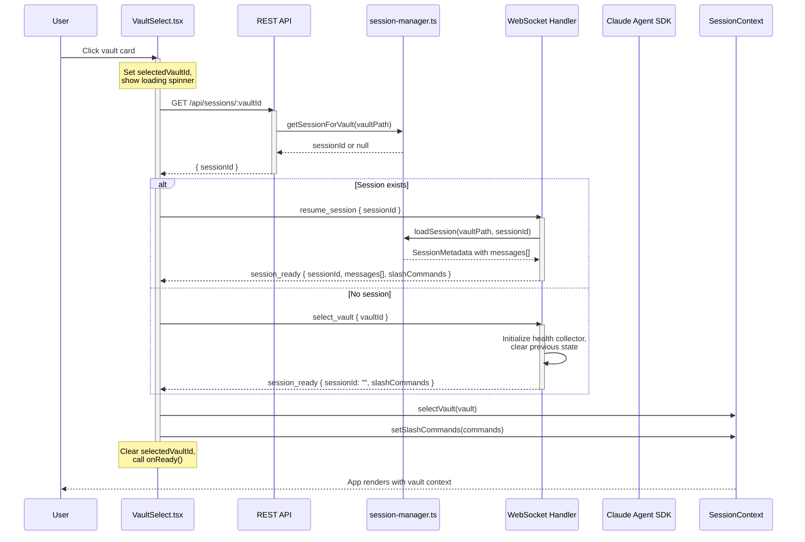

# Diagram: Session Auto-Resume Flow

## Context

Sessions in Memory Loop span two communication channels: REST API for lookup and WebSocket for establishment. This diagram shows how a user clicking a vault card (or auto-resuming from localStorage) triggers the session restoration flow.

## Diagram

## Reading the Diagram

The flow has two distinct phases:

**Phase 1: Session Lookup (REST)**
- VaultSelect calls `GET /api/sessions/:vaultId` to check if a session exists
- The endpoint calls `getSessionForVault()` which scans `~/.memory-loop/sessions/*.json` for the most recently active session for that vault
- Returns `sessionId` if found, `null` otherwise

**Phase 2: Session Establishment (WebSocket)**
- If a session exists: `resume_session` loads the stored conversation history and returns it in `session_ready.messages[]`
- If no session: `select_vault` initializes a fresh vault connection with empty session

**Why the split?**
- REST is simpler for the lookup (stateless, cacheable, standard HTTP semantics)
- WebSocket is necessary for session establishment because it needs to set up connection-specific state (health collector, search index subscription, active query tracking)

## Key Insights

- **Graceful fallback**: If REST lookup fails (network error, 4xx/5xx), the frontend falls back to `select_vault` and starts fresh rather than failing entirely
- **Error recovery**: If `resume_session` returns `SESSION_NOT_FOUND`, VaultSelect automatically sends `select_vault` to start a new session
- **State isolation**: Each WebSocket connection maintains its own `ConnectionState` with vault, session, and health collector
- **Auto-resume on refresh**: The same flow is triggered from localStorage on page load, not just user clicks

## Not Shown

- **Slash command caching**: Both paths load cached slash commands from vault config to avoid SDK startup delay
- **Health collector lifecycle**: Created on vault selection, cleared on vault switch
- **Token tracking**: Cumulative token usage resets on new session
- **Mock SDK mode**: When `MOCK_SDK=true`, the flow skips real SDK session creation

## Related

- [Communication Layer](../reference/_infrastructure/communication-layer.md) - Protocol details
- [Vault Selection](../reference/_infrastructure/vault-selection.md) - UI component spec
- `frontend/src/components/vault/VaultSelect.tsx:435-469` - handleVaultClick implementation
- `backend/src/websocket-handler.ts:869-914` - handleResumeSession implementation
