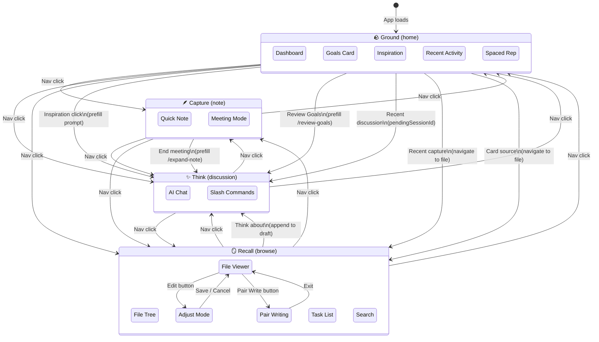

# Diagram: GCTR Mode Transitions

## Context

Memory Loop organizes work around four modes (GCTR framework). While users can switch freely via the nav bar, certain actions trigger contextual transitions that carry data between modes. This diagram shows both the direct switches and the data-carrying transitions.

## Diagram

## Reading the Diagram

**Solid arrows** represent transitions. The nav bar enables any-to-any switching, but certain UI actions trigger transitions with data:

| From | Action | To | Data Carried |
|------|--------|-----|--------------|
| Ground | Click inspiration prompt | Think | `discussionPrefill` with prompt text |
| Ground | Click "Review Goals" | Think | `discussionPrefill` with `/review-goals` |
| Ground | Click recent discussion | Think | `pendingSessionId` for session resume |
| Ground | Click recent capture | Recall | `currentPath` set to note file |
| Ground | Click card source | Recall | `currentPath` set to source file |
| Capture | End meeting | Think | `discussionPrefill` with `/expand-note {path}` |
| Recall | "Think about" menu | Think | File path appended to localStorage draft |
| Recall | Edit button | Adjust | `isAdjusting: true`, copies content to `adjustContent` |
| Recall | Pair Write button | Pair Writing | `isPairWritingActive: true` |

## Key Insights

- **Think is the convergence point**: Most contextual transitions lead to Think mode. This reflects the GCTR philosophy: Ground orients you toward what needs thinking, Capture collects raw material for thinking, Recall finds context for thinking.

- **Data travels via context**: Transitions use `SessionContext` state (`discussionPrefill`, `pendingSessionId`, `currentPath`) rather than URL params. This keeps the app feel native (no page reloads) but means deep linking isn't supported.

- **Prefill vs Resume**: Two patterns for entering Think mode:
  - **Prefill**: Pre-populates the input box (user must still send)
  - **Resume**: Loads an existing session with history (`pendingSessionId`)

- **Nav bar is always available**: Even during contextual transitions, users can override by clicking a different mode in the nav bar.

## State Preservation

Mode switches don't clear state:
- Think preserves conversation history
- Recall preserves file tree position and expanded directories
- Capture preserves draft text (via localStorage)

This allows workflows like: Think → Recall (find a file) → Think (continue conversation with context).

## Recall Sub-Modes

Recall has two editing sub-modes that overlay the File Viewer:

| Sub-Mode | Entry | Exit | Purpose |
|----------|-------|------|---------|
| **Adjust** | Edit button | Save or Cancel | Direct text editing with syntax highlighting |
| **Pair Writing** | Pair Write button | Exit button | AI-assisted editing with Quick Actions (Tighten, Embellish, Polish, Correct) and Advisory Actions (Validate, Critique, Compare, Discuss) |

Both sub-modes preserve the file tree and current path. Switching GCTR modes while in a sub-mode exits the sub-mode without saving.

## Not Shown

- **View mode toggle**: Recall switches between files and tasks views
- **Search state**: Recall's search overlay with file/content modes
- **Meeting capture flow**: Complex state machine within Capture mode
- **Vault switching**: Returns to vault selection, not a mode transition

## Related

- [System Overview](../reference/_overview.md) - GCTR framework explanation
- [Navigation Bar](../reference/navigation-bar.md) - Nav component spec
- [Pair Writing](../reference/pair-writing.md) - AI-assisted editing spec
- [Recall](../reference/recall.md) - File browser and viewer spec
- `frontend/src/components/shared/ModeToggle.tsx` - Nav bar implementation
- `frontend/src/contexts/session/types.ts:27` - AppMode type definition
