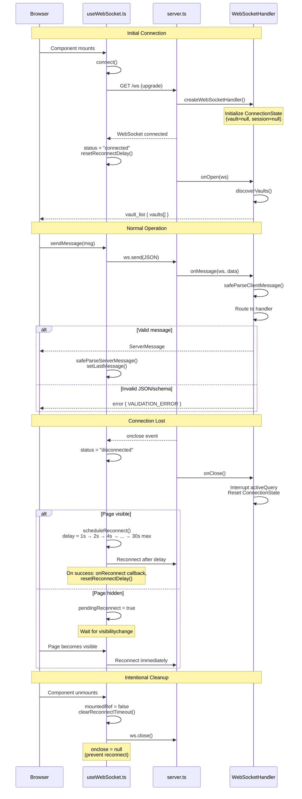

# Diagram: WebSocket Connection Lifecycle

## Context

Memory Loop uses WebSocket for real-time communication: AI streaming, tool execution display, and session state. This diagram shows the full lifecycle from connection to cleanup, including the auto-reconnect behavior that makes the app resilient to network issues.

## Diagram

## Reading the Diagram

The lifecycle has four phases:

**1. Initial Connection**
- React component mounts, `useWebSocket` calls `connect()`
- Hono upgrades HTTP to WebSocket, creates a fresh `WebSocketHandler` instance
- Handler initializes empty `ConnectionState` and sends `vault_list` on open
- Client sets status to "connected" and resets reconnect delay

**2. Normal Operation**
- Client sends `ClientMessage` via `sendMessage()`
- Handler validates JSON and schema with `safeParseClientMessage()`
- Routes to appropriate handler (select_vault, discussion_message, etc.)
- Client validates responses with `safeParseServerMessage()`

**3. Connection Lost (Auto-Reconnect)**
- On close, handler interrupts any active SDK query and resets state
- Client schedules reconnect with exponential backoff (1s → 2s → 4s → max 30s)
- If page is hidden, defers reconnect until visible (saves battery on mobile)
- On reconnect success, fires `onReconnect` callback and resets delay

**4. Intentional Cleanup**
- On unmount, client sets `onclose = null` to prevent reconnect loop
- Closes WebSocket cleanly without triggering retry logic

## Key Insights

- **State isolation**: Each connection gets its own `WebSocketHandler` instance with independent `ConnectionState`. No shared state between connections.
- **Visibility-aware**: Reconnection pauses when the browser tab is hidden, resuming immediately when visible. This prevents battery drain on mobile.
- **Graceful degradation**: Invalid messages return `VALIDATION_ERROR` but don't close the connection. The client can retry.
- **No session persistence in WebSocket**: The WebSocket itself doesn't persist sessions. Session resumption requires the [auto-resume flow](./session-auto-resume.md) via REST + WebSocket.

## ConnectionState Contents

Each WebSocket connection maintains:

| Field | Purpose |
|-------|---------|
| `currentVault` | Selected vault (null until select_vault) |
| `currentSessionId` | Active session ID (null until first discussion) |
| `activeQuery` | Running SDK query with interrupt() method |
| `pendingPermissions` | Tool permission requests awaiting user response |
| `healthCollector` | Tracks backend issues for health_report |
| `cumulativeTokens` | Token usage across session turns |
| `activeMeeting` | In-progress meeting capture state |

## Not Shown

- **Message routing details**: The handler's switch statement covers 20+ message types
- **SDK streaming**: How `discussion_message` streams response_chunk events
- **Health reporting**: How healthCollector subscribes to issues and pushes updates
- **Mock mode**: When `MOCK_SDK=true`, SDK interactions are simulated

## Related

- [Session Auto-Resume](./session-auto-resume.md) - How sessions are restored after reconnect
- [Communication Layer](../reference/_infrastructure/communication-layer.md) - Protocol details
- `frontend/src/hooks/useWebSocket.ts` - Client implementation
- `backend/src/websocket-handler.ts` - Server implementation
- `backend/src/handlers/types.ts:181-204` - ConnectionState interface
