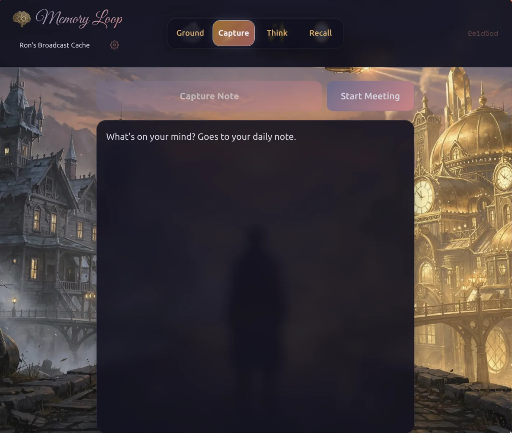

# Memory Loop


[](https://codecov.io/gh/rjroy/memory-loop)

<br>


A mobile-friendly web interface for interacting with Obsidian vaults via Claude AI. Capture thoughts, have AI-powered conversations, and browse your notes from any device.

## Features

<table>
  <tr>
    <td align="center"><br><b>Home</b></td>
    <td align="center"><br><b>Note</b></td>
    <td align="center"><br><b>Chat</b></td>
    <td align="center"><br><b>View</b></td>
  </tr>
</table>

- **Home** — Dashboard showing your goals, AI-generated inspiration, and recent activity
- **Note** — Quick capture that appends to daily notes with timestamps
- **Chat** — AI conversations powered by Claude, with full vault access and image upload
- **View** — Browse files, manage tasks, search notes, and view images/PDFs/videos

**Designed for mobile:**

- Touch-friendly UI with 44px+ tap targets
- Works on any screen size (320px and up)
- Draft persistence across sessions

**Security:** Path traversal protection, symlink blocking, and SDK permission controls keep operations within your vault. AI sessions have a 50-turn limit and $2 USD spending cap.

## Quick Start

**Prerequisites:** [Bun](https://bun.sh) v1.1+, one or more Obsidian vaults (or directories with `CLAUDE.md`), Claude Code CLI configured (for AI features via OAuth)

```bash
git clone <repo-url>
cd memory-loop
bun install

cp .env.example .env
# Edit .env with your VAULTS_DIR path

bun run dev
```

Open http://localhost:5173 in your browser.

## Configuration

### Environment Variables

```bash
VAULTS_DIR=/path/to/vaults  # Required: directory containing your vaults
PORT=3000                   # Backend port (default: 3000)
HOST=0.0.0.0                # Bind address (default: 0.0.0.0)
MOCK_SDK=true               # Test without API calls
```

### Vault Requirements

Each vault needs a `CLAUDE.md` file at its root. Optional structure for full feature support:

- `00_Inbox/` — Daily notes location (configurable)
- Goals section in `CLAUDE.md` — Displayed on Home dashboard
- `06_Metadata/memory-loop/` — Inspiration prompt sources

### Per-Vault Configuration

Create a `.memory-loop.json` file at the vault root to customize paths:

```json
{
  "contentRoot": "content",
  "inboxPath": "journal",
  "metadataPath": "meta/memory-loop"
}
```

| Option | Description | Default |
|--------|-------------|---------|
| `contentRoot` | Subdirectory containing vault content (useful for Quartz sites) | `""` (vault root) |
| `inboxPath` | Directory for daily notes, relative to contentRoot | Auto-detected or `00_Inbox` |
| `metadataPath` | Directory for inspiration sources, relative to contentRoot | `06_Metadata/memory-loop` |

All paths are relative to the vault root. Path traversal outside the vault is rejected for security.

## Commands

```bash
bun run dev        # Start dev servers (backend + frontend)
bun run build      # Build for production
bun run test       # Run tests
bun run typecheck  # TypeScript checking
bun run lint       # ESLint
```

### Production

```bash
bun run build
./scripts/launch.sh
```

The backend runs from TypeScript source (not bundled) because Claude Agent SDK requires it.

## Network Access

Access from other devices on your network:

```bash
# Find your local IP
hostname -I | awk '{print $1}'

# Access from phone/tablet
http://YOUR_IP:5173
```

## Documentation

- [Usage Guide](docs/usage/README.md) — How to use each tab (Ground, Capture, Think, Recall)
- [Widgets](docs/widgets/README.md) — Configure computed widgets for dashboards and file views

### Deployment

- [HTTPS/TLS Setup](docs/deployment/https-setup.md) — Certificate configuration for secure access
- [systemd Service](docs/deployment/systemd.md) — Run Memory Loop automatically on boot

## Architecture

```
memory-loop/
├── backend/        # Hono server + Claude Agent SDK
├── frontend/       # React 19 + Vite
└── shared/         # Zod schemas for WebSocket protocol
```

Communication happens over WebSocket with typed message schemas.

## License

MIT
