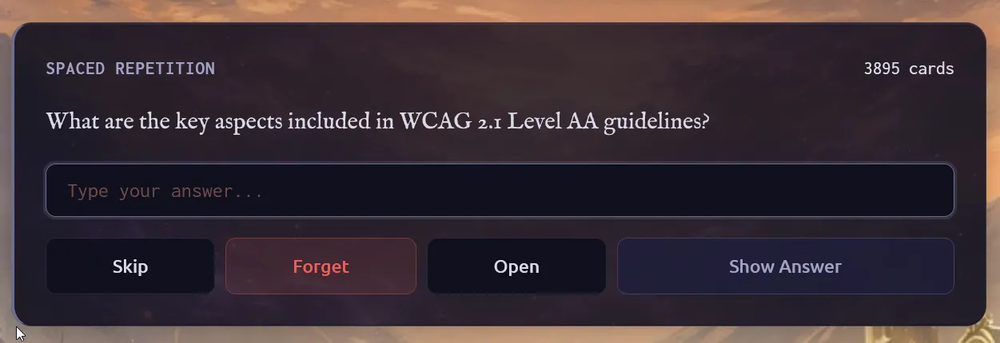
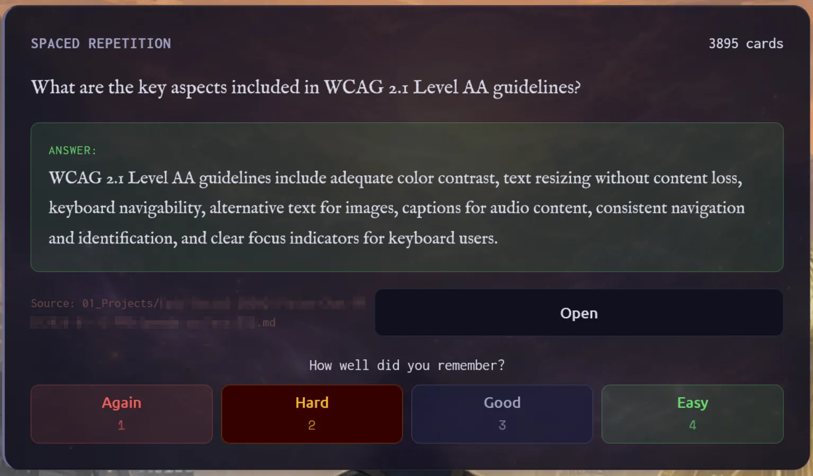

# Ground Tab

The Ground tab is your home base. It provides an at-a-glance view of your vault's current state, surfaces timely prompts for reflection, and gives quick access to recent activity.

## Vault Card

At the top of the Ground tab, the vault card displays:

- **Vault name**: The display name from your vault's configuration
- **Subtitle**: Optional description (if configured in `.memory-loop.json`)

[ img: Vault card showing name and subtitle ]

### Debrief Buttons

Below the vault name, contextual debrief buttons appear based on the current date and your recent activity:

| Button | When it appears | What it does |
|--------|-----------------|--------------|
| Daily Debrief | When you have a note for today | Opens Think with `/daily-debrief` command |
| Weekly Debrief | Friday through Sunday | Opens Think with `/weekly-debrief` command |
| Monthly Summary | Last 3 days or first 3 days of month | Opens Think with `/monthly-summary YYYY MM` command |

[ img: Vault card with debrief buttons visible ]

The buttons trigger AI-assisted reflection workflows. Tap any button to switch to the Think tab with the corresponding command pre-filled.

## Inspiration Section

The inspiration section displays content from your vault's inspiration sources to spark reflection and conversation.

[ img: Inspiration card with quote and prompt ]

### Quote

A daily inspirational quote selected from your vault's configured quote sources. The quote appears with attribution when available.

**Interaction**: Tap the quote to open the Think tab with the quote pre-filled as your message. This lets you explore the quote's meaning or discuss how it relates to your work.

### Contextual Prompt

A context-aware prompt drawn from your vault's prompt sources. These prompts change based on the day and are designed to encourage reflection.

**Interaction**: Tap the prompt to open the Think tab with the prompt pre-filled. The AI will engage with your response in the context of your vault.

## Goals Section

If your vault has a configured goals file (set via `vault.goalsPath` in `.memory-loop.json`), its content displays here as rendered markdown. This keeps your current objectives visible whenever you open the app.

[ img: Goals card showing rendered markdown ]

**Interaction**: Tap the goals card to open the Think tab with the `/review-goals` command. The AI will analyze your goals and help you assess progress, identify blockers, or refine priorities.

## Spaced Repetition Widget

When you have flashcards due for review, the spaced repetition widget appears on the Ground tab. This widget helps you retain knowledge from your vault using the SM-2 algorithm.

### How It Works

1. **Card Discovery**: The system periodically scans your vault for knowledge-worthy content and generates Q&A flashcards from factual information in your notes.

2. **Spaced Review**: Cards appear for review based on how well you remember them. Cards you know well appear less frequently; cards you struggle with appear more often.

3. **Widget Display**: When cards are due, the widget shows the count and lets you review directly from Ground.

### Review Flow

#### Question Phase

The card shows only the question. Type your answer in the input field to help focus your recall before revealing.

**Actions available:**
- **Skip**: Move the card to the end of today's queue
- **Forget**: Archive the card permanently (requires confirmation)
- **Open**: Edit the card file in Recall (useful if the question needs fixing)
- **Show Answer**: Reveal the answer

Press **Enter** while in the answer input to reveal the answer.

#### Answer Phase

After revealing, your typed answer appears above the correct answer for comparison. The source file is shown so you can verify context.

Rate how well you remembered:
- **Again** (1): Completely forgot, need to see it soon
- **Hard** (2): Struggled but eventually remembered
- **Good** (3): Recalled correctly with some effort
- **Easy** (4): Recalled instantly and confidently

Tap **Open** next to the source file to view the original note in Recall.

### Keyboard Shortcuts

- **Enter**: Reveal answer (when typing in question phase)
- **1-4**: Select assessment rating (when answer is revealed)

### Completion

When you've reviewed all due cards, the widget shows a completion message with the count of cards reviewed. New cards become due based on their scheduled review dates.

### Card Sources

Cards are generated from your vault notes during discovery runs:
- **Daily discovery**: Processes notes modified in the last 24 hours
- **Weekly catch-up**: Gradually processes older unprocessed notes

Cards include a source reference so you can find the original note if needed.

## Ground Widgets

If you've configured vault widgets with `location: ground`, they appear in this section. Ground widgets show vault-wide aggregations and statistics.

[ img: Ground widgets showing aggregate data ]

See the [Widgets documentation](../widgets/README.md) for configuration details.

## Health Panel

When the backend detects issues that need attention, a collapsible Health Panel appears at the bottom of the Ground tab. This panel only shows when there are active issues to report.

[ img: Health panel showing warning and error items ]

### When It Appears

The Health Panel is hidden by default and only becomes visible when:
- File watcher encounters errors monitoring your vault
- Vault configuration has problems
- Cache systems report issues
- Other backend components report problems

When issues are resolved, the panel automatically disappears.

### Severity Levels

Issues are categorized by severity:

| Level | Meaning |
|-------|---------|
| Error | Something is broken and needs immediate attention |
| Warning | A potential problem that may affect functionality |

### Issue Categories

The panel groups issues by their source:

- **Vault Config**: Problems with `.memory-loop.json` or vault setup
- **File Watcher**: Errors monitoring your vault for changes
- **Cache**: Issues with caching systems
- **General**: Other backend issues

### Dismissal

Tap an issue to dismiss it from the panel. Dismissed issues won't reappear unless the underlying problem recurs. Errors typically require fixing the root cause before they stop appearing.

## Recent Activity

The bottom section shows your recent captures and discussions, organized into two groups:

### Recent Captures

Each capture card shows:
- The captured text (truncated if long)
- Timestamp and relative date
- **View** button to open the daily note in Recall

[ img: Recent captures section with View buttons ]

**Interaction**: Tap **View** to switch to the Recall tab and open the daily note containing that capture. This lets you see the full context around the note.

### Recent Discussions

Each discussion card shows:
- A preview of the conversation
- Timestamp and relative date
- Message count
- **Resume** and **Delete** buttons

[ img: Recent discussions section with Resume and Delete buttons ]

**Interactions**:
- **Resume**: Switch to Think and continue the conversation where you left off
- **Delete**: Remove the session permanently (requires confirmation)

The currently active session cannot be deleted; you must start a new session first.

## Typical Workflows

### Morning Check-in

1. Open Ground tab to see your goals and today's inspiration
2. Tap the quote or prompt to start a reflective discussion
3. If you have yesterday's captures, tap **View** to review them

### End-of-Day Debrief

1. After capturing notes throughout the day, return to Ground
2. Tap **Daily Debrief** to have the AI summarize your day's notes
3. The AI will pull themes and suggest what to carry forward

### Weekly Review

1. On Friday through Sunday, the **Weekly Debrief** button appears
2. Tap it to get an AI-generated summary of your week
3. Review patterns, accomplishments, and areas for focus

### Goal Tracking

1. Tap your goals card to trigger `/review-goals`
2. The AI analyzes your goals against recent vault activity
3. Get suggestions for next actions or goal refinements

### Knowledge Review

1. When the spaced repetition widget shows due cards, tap to start reviewing
2. For each card, think of the answer before revealing it
3. Rate your recall honestly (better recall means longer intervals)
4. Complete your daily review to strengthen long-term retention
